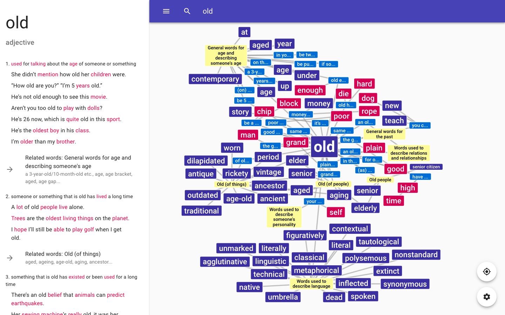
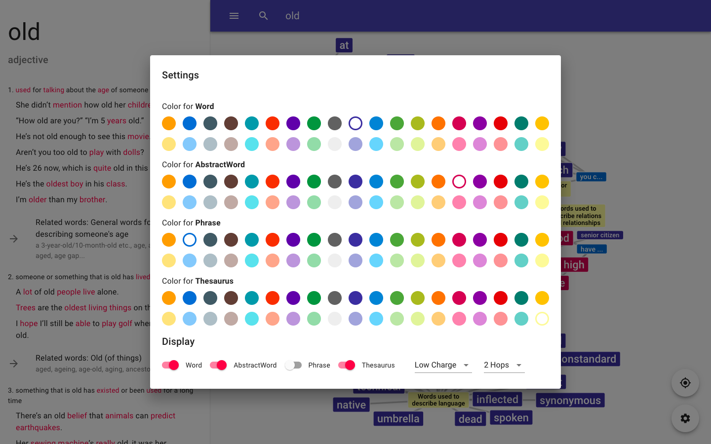
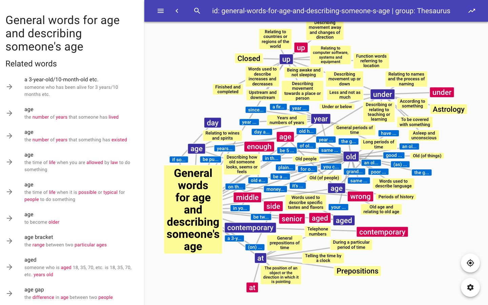
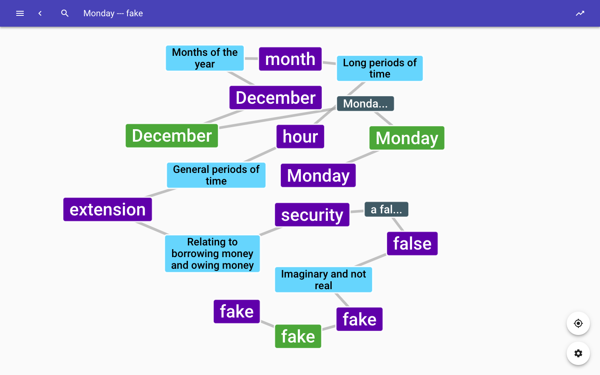

# Word Bubbles

## Features

* App built with Electron.js
* Force-directed layouts with collision detection
    * Zoom and auto-fit available
    * Multiple themes provided
* Dictionary entries available in Sidebars
* Over 10000 words, along with 8000 phrases and 3000 thesaurus
* Search for related entries for at most 3 hops away
* Search for the shortest path between two entries
* Multiple query parameters supported

## Demo

## Goals

### Relation type

* Embedded in a phrase
* Thesaurus (Synonyms, Related)
* Added: Word family (from AWL)

### Allowed query

* A word (redirect to the word)
* Two words (find a link)
* ~~Optional: Autocomplete support~~

### Layout

* Drawer: display the dictionary info of the selected word
* Graph
* Search bar
* Settings: Maximum-hop display
